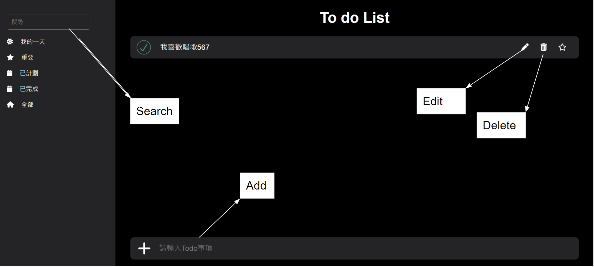
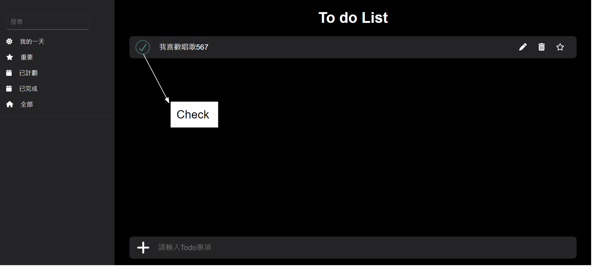
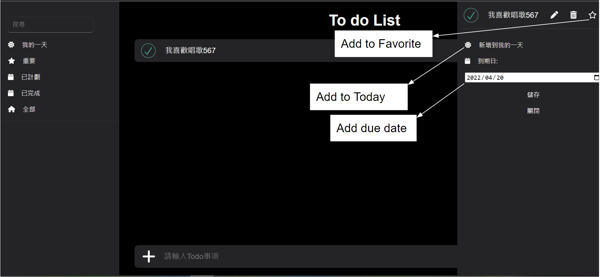
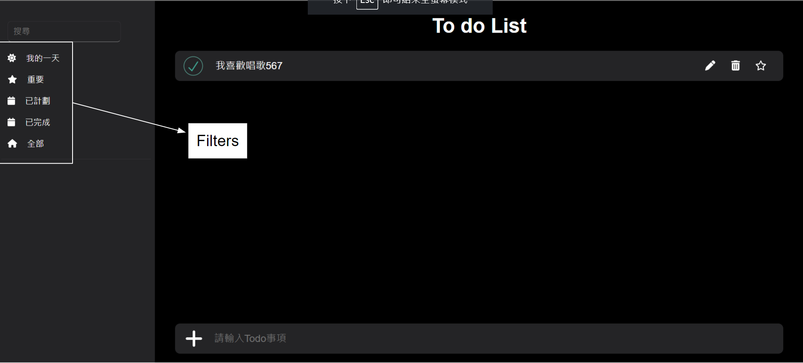

# To do List

### This front end project is made based on "Microsoft To Do" APP using Vue 3.

<br>

# Project setup

### Step 1: Clone project

```bash
git clone https://github.com/eji6u94g/Todo-list.git
```

### Step 2: Installation, run mock server and run project

```
$ npm install
$ npm run serve
$ json-server --watch data/db.json
```

<br>

# Tools and skills used in To do List

1.  CSS / SCSS
2.  Vue 3
3.  Vuex
4.  axios: RESTful API
5.  uuid
6.  vue-toastification
7.  json-server: mock API

<br>

# Function

- Add / Delete / Edit / search todos
    
- Check todos
    
- Add todos to "Favorite"
- Click todo and add todo to "Today" 
- Click todo and add "due date" to todo
    
- Display todos in different states by filters in navbar
    
